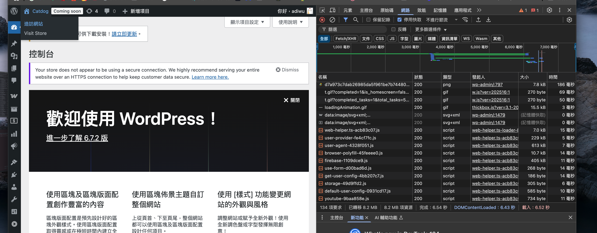
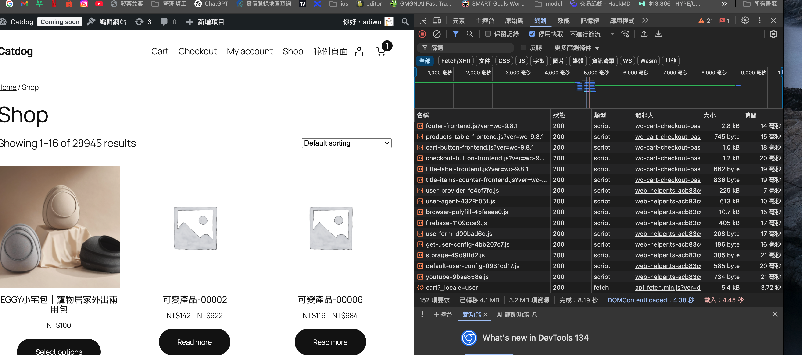

# question

## 1. 請將 Wordpress + WooCommerce 在 local 用 nginx + php-fpm 跑起來，並做以下的分享
###  1. 效能分析: 

#### 1. 用您使用過的壓力測試的方式，做基礎的壓力測試，並量化的分析，找出系統前幾名的Performance Overhad。
ans:

#### 2. 對於分析結果提出解決方式，並用不同的方式來優化。
ans:

#### 3. Note: 在基於PHP WooCommerce為基底的情況下，優化方式沒有限制。
ans:

### 2. 系統架構分析

#### 1. Trace Wordpress 與 WooCommerce 在 Post, Order, Order_Item, User, Session 等相關Table  Schema，並且分析這樣的 DB Schema 的優點與缺點。
ans: 

#### 2. 基於您對於架構的了解，假設要讓這樣的架構 Scale Up 您會怎麼設計。
ans:

#### 3. (Optional) 認為架構要如何改進。
ans: 

## 2. 想請您建立兩個開發環境，Laravel (使用PHP撰寫) 和 Nest.js (使用Typescript撰寫)

### 1. 請實作基礎的 Order CRUD 做為掌握框架的基礎練習。
ans:

### 2. 請閱讀這兩份框架的技術功能，針對這兩個框架的各自的優缺點，做出一份分析和比較。
ans:

### 3. 承第一題，一樣對於系統做出壓力測試，並準備效能的比較。
ans:

### 4. (Optional) 以設計模式 (or UML) 的方式，描述這兩個 Framework 中，關鍵 Class 的設計理念。
ans:


## 額外紀錄事項 之後整合到回答中

1. myslq replication
電商特點為讀多寫少，寫入走master, 讀取走slave
這部分就先不用測試了

高可用：master如果掛掉，可切換到slave

1. 在應用層或是proxySQL做切割，如果是RDS的話可以直接用雲端服務做到


我的方向還是以查詢商品為主，所以我依照商品的查詢功能去grep
發現有許多search會使用到like %% 這會影響到index使用
尤其時前後都過%%的




shop頁面



## 系統優化

1 
響應時間過長:
95% 的請求響應時間超過 5.95 秒，遠高於設定的 2 秒閾值
頁面加載時間的 95 百分位數達到 5.95 秒，也超過了設定的 3 秒閾值
錯誤率過高:
請求失敗率為 16.66%，遠高於設定的 1% 閾值
檢查結果顯示 31.41% 的檢查失敗
具體頁面問題:
商品詳情頁面有嚴重問題，100% 的請求都返回錯誤狀態碼
首頁、商品列表頁和搜索結果頁的加載時間都有約 40-44% 超過 2 秒
加入購物車操作也有約 44% 的請求超過 2 秒
系統吞吐量:
平均每秒處理約 18.4 個請求
總共處理了 10,130 個 HTTP 請求
接收數據量為 594 MB，發送數據量為 1.1 MB

```

  █ THRESHOLDS 

    http_req_duration
    ✗ 'p(95)<2000' p(95)=5.95s

    http_req_failed
    ✗ 'rate<0.01' rate=16.66%

    page_load_time
    ✗ 'p(95)<3000' p(95)=5958.274

    requests_per_second
    ✗ 'rate>10' rate=100.00%


  █ TOTAL RESULTS 

    checks_total.......................: 16882  30.661191/s
    checks_succeeded...................: 68.58% 11579 out of 16882
    checks_failed......................: 31.41% 5303 out of 16882

    ✓ 首頁狀態碼為 200
    ✗ 首頁加載時間 < 2s
      ↳  59% — ✓ 997 / ✗ 692
    ✓ 商品列表頁狀態碼為 200
    ✗ 商品列表頁加載時間 < 2s
      ↳  56% — ✓ 955 / ✗ 734
    ✓ 搜索結果狀態碼為 200
    ✗ 搜索結果加載時間 < 2s
      ↳  56% — ✓ 955 / ✗ 734
    ✗ 商品詳情頁狀態碼為 200
      ↳  0% — ✓ 0 / ✗ 1688
    ✗ 商品詳情頁加載時間 < 2s
      ↳  57% — ✓ 965 / ✗ 723
    ✓ 加入購物車狀態碼為 200
    ✗ 加入購物車操作時間 < 2s
      ↳  56% — ✓ 954 / ✗ 732

    CUSTOM
    errors..................................................................: 1688    3.065756/s
    page_load_time..........................................................: avg=2027.999831 min=141.383  med=1080.407 max=9914.923 p(90)=4141.107 p(95)=5958.274
    requests_per_second.....................................................: 100.00% 8441 out of 8441

    HTTP
    http_req_duration.......................................................: avg=2.02s       min=141.38ms med=1.07s    max=9.91s    p(90)=4.12s    p(95)=5.95s   
      { expected_response:true }............................................: avg=2.03s       min=143.32ms med=1.08s    max=9.91s    p(90)=4.12s    p(95)=5.97s   
    http_req_failed.........................................................: 16.66%  1688 out of 10130
    http_reqs...............................................................: 10130   18.398168/s

    EXECUTION
    iteration_duration......................................................: avg=22.09s      min=7.36s    med=16.99s   max=56.93s   p(90)=34.9s    p(95)=46.43s  
    iterations..............................................................: 1684    3.058491/s
    vus.....................................................................: 2       min=1             max=100
    vus_max.................................................................: 100     min=100           max=100

    NETWORK
    data_received...........................................................: 594 MB  1.1 MB/s
    data_sent...............................................................: 1.1 MB  2.1 kB/s


running (9m10.6s), 002/100 VUs, 1682 complete and 5 interrupted iterations

running (9m10.6s), 000/100 VUs, 1684 complete and 5 interrupted iterations
default ✓ [======================================] 000/100 VUs  9m0s
ERRO[0550] thresholds on metrics 'http_req_duration, http_req_failed, page_load_time, requests_per_second' have been crossed 
```


2.
```

         /\      Grafana   /‾‾/  
    /\  /  \     |\  __   /  /   
   /  \/    \    | |/ /  /   ‾‾\ 
  /          \   |   (  |  (‾)  |
 / __________ \  |_|\_\  \_____/ 

     execution: local
        script: fixed-load-test.js
        output: -

     scenarios: (100.00%) 1 scenario, 100 max VUs, 1m30s max duration (incl. graceful stop):
              * default: Up to 100 looping VUs for 1m0s over 1 stages (gracefulRampDown: 30s, gracefulStop: 30s)


  █ THRESHOLDS 

    http_req_duration
    ✓ 'p(95)<3000' p(95)=2.8s

    http_req_failed
    ✓ 'rate<0.05' rate=0.00%

    page_load_time
    ✓ 'p(95)<4000' p(95)=2801.513


  █ TOTAL RESULTS 

    checks_total.......................: 2050   23.994254/s
    checks_succeeded...................: 84.29% 1728 out of 2050
    checks_failed......................: 15.70% 322 out of 2050

    ✓ 首頁狀態碼為 200
    ✗ 首頁加載時間 < 2s
      ↳  72% — ✓ 148 / ✗ 57
    ✓ 商品列表頁狀態碼為 200
    ✗ 商品列表頁加載時間 < 2s
      ↳  59% — ✓ 121 / ✗ 84
    ✓ 搜索結果狀態碼為 200
    ✗ 搜索結果加載時間 < 2s
      ↳  66% — ✓ 137 / ✗ 68
    ✓ 商品詳情頁狀態碼為 200
    ✗ 商品詳情頁加載時間 < 2s
      ↳  71% — ✓ 147 / ✗ 58
    ✓ 加入購物車狀態碼為 200
    ✗ 加入購物車操作時間 < 2s
      ↳  73% — ✓ 150 / ✗ 55

    CUSTOM
    page_load_time..........................................................: avg=1443.625106 min=136.652 med=1430.813 max=3238.166 p(90)=2667.3064 p(95)=2801.513
    requests_per_second.....................................................: 100.00% 1025 out of 1025

    HTTP
    http_req_duration.......................................................: avg=1.44s       min=86.19ms med=1.43s    max=3.26s    p(90)=2.66s     p(95)=2.8s    
      { expected_response:true }............................................: avg=1.44s       min=86.19ms med=1.43s    max=3.26s    p(90)=2.66s     p(95)=2.8s    
    http_req_failed.........................................................: 0.00%   0 out of 1640
    http_reqs...............................................................: 1640    19.195403/s

    EXECUTION
    iteration_duration......................................................: avg=21.69s      min=6.31s   med=23.09s   max=31.72s   p(90)=29.21s    p(95)=30.02s  
    iterations..............................................................: 205     2.399425/s
    vus.....................................................................: 1       min=1            max=99 
    vus_max.................................................................: 100     min=100          max=100

    NETWORK
    data_received...........................................................: 74 MB   871 kB/s
    data_sent...............................................................: 279 kB  3.3 kB/s


running (1m25.4s), 000/100 VUs, 205 complete and 0 interrupted iterations
default ✓ [======================================] 000/100 VUs  1m0s
```


測試流程 模擬玩家正常操作
1. 首頁
2. 商品列表
3. 商品詳情
4. 加入購物車
結帳流程要另外設定, 佔不考慮其他流程, 先以這樣的流程當作一個完整的測試用例

