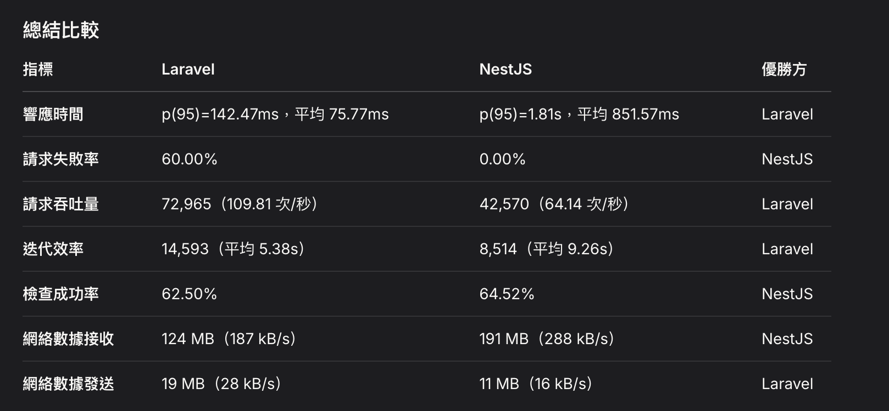
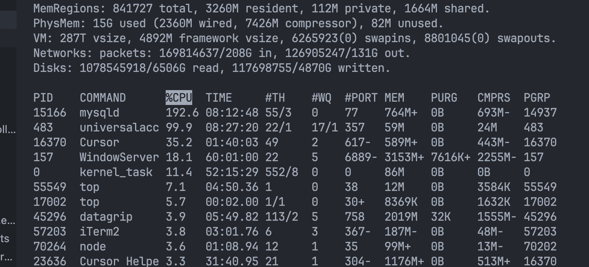
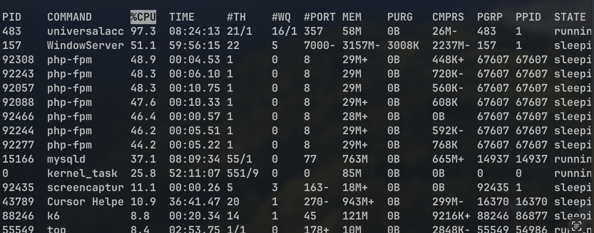

## Woocommerce + wordpress, local + php-fpm


### 預計


1. 因為這部分是要做框架上的效能分析, 建立假資料大量，模擬正常用戶行為
2. 使用k6進行壓力測試分析，在技術分享上得知的壓力測試工具可以寫js腳本進行自訂義測試，如果有swagger也可以直接串接使用，剛好這次機會拿來使用
3. 電商需要處理高併發，以及短時間內大量請求的面對促銷活動等需求
4. 依照慢日誌查詢觀察slow query, explain做進一步分析以及觀察是否有可以優化的部分
5. top -c 觀察cpu, memory, 以及php-fpm的進程數


### Setting


- macOS 23.4 
- nginx 
- PHP 8.4 (opcache=ON)
- Mysql 9.0
- php-fpm master*1, worker*5 
- 測試工具：k6


- 測試資料: 約3w筆資料, 每個商品都包含標籤分類
- 模擬用戶行為模型


1. 首頁
2. 商品列表
3. 商品詳情
4. 加入購物車


### test case


測試 1：100 * users, 1 min
測試 2：200 * users, 11 min 
測試 3：200 * users, 11 min (優化 PHP-FPM + nginx連接數)


#### 為什麼用這樣的方式？
- 先確認系統上的可行性以及基本冒煙測試 -> 壓力增加的負載狀況 -> 優化後的覆載狀況
- 預期電商會遇到的瓶頸，通常會遇到的都是突然的流量暴增導致伺服器負載過高，所以以這樣的狀況進行測試。


#### 預計會遇到什麼問題？


- php本身佔的內存就比較大, 也還沒追加快取, php-fpm也用預設的數量, 大量的請求會被quene起來
- 查詢如果沒有index，會導致php-fpm壓力上升，可能會有掉線, timeout的問題
- 資料表的index設計如果沒有做好, 會有table scan的問題
- 不確定3w筆資料是否足夠, 但如果index沒有設計好做出慢日誌查詢應該找得出來


預期會有以下問題產生


1. woocommerce資料表設計會導致就慢日誌的問題發生，多表join以及table scan問題
2. PHP本身會有較大的內存消耗，預期在比較極限的狀況下會有資源耗盡的問題


### 結論
>先回答題目，再進行補充以及結論，最後會附上壓力測試結果以及細節分析。


#### 前三大performance overhead


- php-fpm 佔用問題以及資源限制
> 狀況：
> 1. 高併發狀況下發生connection reset by peer, 
> 2. php-fpm.log顯示max_children已達限制
> 3. 單線程原因，cpu,記憶體佔用都偏高
> 解決做法：
> 1. 依照用戶或極端狀況追加php-fpm worker, 根據記憶體做動態調整
> 2. 可以從nginx做負載均衡, 請求limit，也可以防止攻擊行為
> 3. 把異步任務拆出去做，，減少http服務器負載
> 4. 前端的部分也可以做CDN加速 減少頁面撈取的重複行為
> 5. macos 有 kqueue 可以做效能的上的優化
> 


- woocommerce table 設計造成的資料庫負擔
- > 狀況：
> 1. 採用主表跟meta表做擴充，彈性高但數據一旦大join的效能就會導致查詢下降
> 2. meta表中的value用longtext, 無法設定有效index
> 3. meta表的內容擴大迅速，我嘗試建立幾個商品meta是以指數成長(我沒有細看精準的內容都寫了什麼)
> 4. 內部sql語法使用不當, 資料表中的內容變大導致
> 解決做法：
> 1. 可以考慮與mongo結合, 可以避免大表join的關聯直接在應用層讀取, 因為這部分也是讀多寫少, 也不用join, 但要重新開發代碼架構
> 2. 結合redis，舉例項熱門度total_sales可以改從redis去做
> 3. mysql優化語法 e.g. not in -> left join is null
> 4. 做partition, 可以從post_id去切
> 


- 非同步處理任務另外處理, 因為死所導致系統出問題
- > 狀況：
> 1. Action Scheduler 更新 claim 發生死鎖或鎖等待
> 2. 非同步任務影響到主流程
> 3. 另外log持久數據也紀錄在mysql中增加負擔
> 解決做法：
> 1. 追加redis分散式鎖，取到鎖再做, 以及retry機制, timeout機制
> 2. 任務隊列可以搭配supervisor+quene, 消息持久, 可以水平擴充處理更多任務, 高吞吐量
> 3. 日誌處理可以直接寫在檔案系統.log，可以由另外雲端系統抽取查看，排程清理


補充：
- 原本的資料庫index就已經有設計好, 應該要針對商品的更加多樣化, 讓join行為更複雜可能會有更明顯的問題產生
- index測試結果可能還需要做更進一步的測試, 資料量再繼續放大


#### 系統架構分析 pros and cons：


pros: 
- 方便擴充
- 符合wordpress架構，正規化設計可以支援插件的擴充


cons:
- 資料庫負擔較大，許多表都需要大量的join，或是 xxx IN (xxx, xxx)
- meta表不適合建立index, 無法後續做較大的優化


#### Scale up 


- 自動擴充機制：使用率達到80%，自動擴充web server，有意外問題發生crush也可以重啟, e.g. aws autoscaling, k8s 
- mysql做主從架構，讀寫分離，crush也可以替換master重啟，也可以做HA
- 排程任務或其他背景任務可以拆到其他框架，可以支援水平擴充


#### 架構如何改進？


- 依照使用者分佈，考慮CDN設置，
- nginx負載均衡, 請求限制，也可以有效防止攻擊
- 快取儲存常用商品列表或熱門排序或是用戶session, 減少mysql負擔
- 資料庫的設計可以依照需求做調整
- 資料庫也可以做導入HA
- 整合其他服務，例如redis, mongo
- 擴充框架可用性, laravel, swoole，可以更有效結合其他功能，開發架構也比較全面(quene job, schedule job, 開發模式)
- 日誌處理跟錯誤處理都需要額外設計, 做日後監控以及問題修復


以上內容還是要考慮應用層面的實際需求。


### 壓力測試結果分析


總共做了三次測試，分析不同的併發用戶對於系統的影響


>(ps. 額外註明, k6產出報告後有利用grok有做報告整理。)


| 參數 | 第一次測試 | 第二次測試 | 第三次測試 |
|------|------------|------------|------------|
| 最大併發用戶 | 100 VUs   | 200 VUs | 200 VUs |
| 每秒請求數 | 19.20/s  | 26.92/s | 44.92/s |
| 平均響應時間 | 1.44秒  | 3.12秒 | 1.04秒 |
| P95 響應時間 | 2.80秒  | 6.29秒 | 3.38秒 |
| 最大響應時間 | 3.26秒   | 9.82秒 | 7.74秒 |
| 錯誤率 | 0.00% |  13.16% | 3.62% |


- 初步壓力測試: smoke test 
快速驗證基本的功能是否正常以及返回頁面的穩定性，以1分鐘100個用戶進行測試，觀察一下基本的效能數據。


- 開始驗證高負載的狀況下的系統
> 200 個 VUs，持續 11 分鐘


問題：頁面回覆開始報錯, error: "connection reset by peer"


php-fpm.log : 
```
[19-Apr-2025 17:48:37] WARNING: [pool www] seems busy (you may need to increase pm.start_servers, or pm.min/max_spare_servers), spawning 8 children, there are 0 idle, and 9 total children
[19-Apr-2025 17:48:38] WARNING: [pool www] server reached pm.max_children setting (10), consider raising it
```


調整php-fpm max_children = 10, 壓力測試是有達到改善但有點暴力。
可以考慮依照實際server內存,cpu做動態調整，也避免做浪費資源。
nginx配置也可以調整連接數。


- 後續調整後效能上有明顯解決，且有注意到mysql slow query log有出現慢日誌，可以做進一步的優化。


#### 慢日誌


1. 這是依照熱門度去做排序的商品列表
```
explain SELECT SQL_CALC_FOUND_ROWS wp_posts.ID
FROM wp_posts
LEFT JOIN wp_wc_product_meta_lookup wc_product_meta_lookup
ON wp_posts.ID = wc_product_meta_lookup.product_id
WHERE 1=1
AND ( wp_posts.ID NOT IN (
SELECT object_id
FROM wp_term_relationships
WHERE term_taxonomy_id IN (8) ) )
AND ((wp_posts.post_type = 'product'
AND (wp_posts.post_status = 'publish'
OR wp_posts.post_status = 'private')))
GROUP BY wp_posts.ID
ORDER BY wc_product_meta_lookup.total_sales DESC, wc_product_meta_lookup.product_id DESC
LIMIT 0, 16;
```


這邊有幾個可以優化的點：
1. 可以把not in () 改成 left join, left join 改善效能
2. 這邊的語法看似只需要把postid找出，可以直接改用distinct
3. 且這邊的熱門度只用total_sales去做排序，可以考慮用redis
4. 商品可以做partition


example
```
ZADD products_rank 1200 101 1100 102 1000 103 900 104


賣出101的一件商品
ZINCRBY products_rank 1 101
```


```
ZREVRANGE products_rank 0 15 WITHSCORES # 取前16個熱門商品id
```


2. 死鎖問題


```
# Time: 2025-04-19T08:41:56.115044Z
# User@Host: root[root] @ localhost []  Id: 106302
# Query_time: 6.736340  Lock_time: 6.734500 Rows_sent: 0  Rows_examined: 394
SET timestamp=1745052109;
UPDATE wp_actionscheduler_actions SET claim_id=319, last_attempt_gmt='2025-04-19 08:41:49', last_attempt_local='2025-04-19 16:41:49' WHERE claim_id = 0 AND scheduled_date_gmt <= '2025-04-19 08:41:49' AND status='pending' ORDER BY priority ASC, attempts ASC, scheduled_date_gmt ASC, action_id ASC LIMIT 25;
```


- 直接撈取claim_id = 0的任務, 可以追加redis鎖，取到鎖再執行。
- 可以改直接指定特定action_id or 依照時間撈取，不需要做排序+limit, e.g. between 26 and 50
  
## laravel 與 nest.js 框架比較


### laravel, laravel-order


pros:
- orm : 簡單易讀好維護，但在做join行為的時候效能比較差
- 開發生態比較完全，社群活躍
- 功能持續更新，後續版本都有在更新新的功能 e.g. 可視化隊列
- 快取系統整合快速方便也很完善。
- 開發效率高, artisan可以直接生成model, controller console等
- migration, seeder 等工具可以快速建立結構


cons:
- 內存使用比較高
- 產品複雜化後，框架比較重
- 單線程限制不支援非同步
- 也沒有提供web socket，需要擴充


### nest.js, nest-order


pros:
- 非同步
- 強型別，大專案上設計上比較嚴謹我個人覺得比較好維護，單看代碼可以了解結構。
- 支援web socket


cons:
- 學習成本比較高
- 類似於swift會有裝飾器，需要依賴文件熟悉使用，無法直接了解實際代碼流程


other:
- 也有腳本類似於artisan, 快速建立模組, 但我這裡沒有特別做研究


#### 其他差別額外提出


- 設計模式


```php


// laravel無特別定義結構，我這邊是controller, servcie, model, 但我為了比較先將以下常見的結構列出
// nest.js有定義結構controller, service entity dto。


// laravel
request -> validator -> controller -> service -> (repository) -> model -> db


// nest.js
request -> Pipe(驗證輸入)/Guard(權限檢查)/Interceptor -> controller -> service -> entity -> dto -> db
```


- 中介層可以直接用裝飾器，laravel需要先註冊middleware，如果是常用的中介層或許nest.js會更直觀。


## laravel nestjs 效能比較


### setting
- laravel php-fpm 沒調整我預設10個worker
- php8.2
- laravel 12
- 資料庫筆數約3w
- 這裡的測試我只有nestjs
- 測試方式：
  > 搜尋全表, 特定order, 建立訂單, 編輯訂單, 刪除訂單 
  >  { duration: '1m', target: 100 },   // 逐步增加到 100 用戶
  >  { duration: '5m', target: 200 },   // 增加到 200 用戶
  >  { duration: '5m', target: 0 },     // 逐步減少到 0
  


結論請grok整理：

> k6有可視化工具也可以抽取到cloud上實現, 但免費版有限制，以及這邊時程關係就直接先請ai整理


#### 為什麼nestjs支援高併發，但在測試流程上響應較慢？


- 重跑了一個nestjs的測試後且觀察cpu狀況發現mysql佔用偏高，應是我沒有實做連線池以及其他優化。


nestjs



laravel



可以看到laravel本身框架就已經先實現了連線池導致mysql佔用就相對來說比較低
應該是這部分造成此結果。


#### 為什麼laravel會有錯誤?


laravel本身單線程機制，worker如果同步阻塞的狀況下就會造成timeout.
nestjs沒有錯誤數據應該只是因為沒有做timeout機制。


## 可以做得更好的地方？


**框架上實現更完善？**
- 這次的時間有限，框架上功能不齊全會導致測試結果較為無用(timeout，連線數量設置，快取)，可以先把功能都補上再比對拿到的數據較有參考價值。


**資源監控？**
- 這次的壓力測試我並沒有在服務器上追加資源上的監控，這次主要針對框架上做請求的比較，更細部的測試還需要加上資源上的監控, 包含cpu, memory佔用等。


**資料量會不會太少測不出來？**
- 這邊僅用先用3w筆資料當作基準，主要設計流程以及做效能上的比較。


**針對特定sql語句做更進一步測試**
- 可以在針對某些語句或特定的表作增加資料量or優化過後再進行測試，像以下sql語句雖然有做index 但filter rows將近一半的數據。


```
SELECT DISTINCT wp_posts.ID, wc_product_meta_lookup.total_sales, wc_product_meta_lookup.product_id
FROM wp_posts
LEFT JOIN wp_wc_product_meta_lookup wc_product_meta_lookup
  ON wp_posts.ID = wc_product_meta_lookup.product_id
LEFT JOIN wp_term_relationships tr
  ON wp_posts.ID = tr.object_id AND tr.term_taxonomy_id = 8
WHERE tr.object_id IS NULL
  AND wp_posts.post_type = 'product'
  AND (wp_posts.post_status = 'publish' OR wp_posts.post_status = 'private')
ORDER BY wc_product_meta_lookup.total_sales DESC, wc_product_meta_lookup.product_id DESC
LIMIT 0, 16;


+--+-----------+--------+----------+-----+----------------+----------------+-------+----+------+--------+---------------------------------------------------------+
|id|select_type|table   |partitions|type |possible_keys   |key             |key_len|ref |rows  |filtered|Extra                                    Ｆ                |
+--+-----------+--------+----------+-----+----------------+----------------+-------+----+------+--------+---------------------------------------------------------+
|1 |SIMPLE     |wp_posts|null      |range|type_status_date|type_status_date|164    |null|179060|100     |Using where; Using index; Using temporary; Using filesort|
+--+-----------+--------+----------+-----+----------------+----------------+-------+----+------+--------+---------------------------------------------------------+


```

