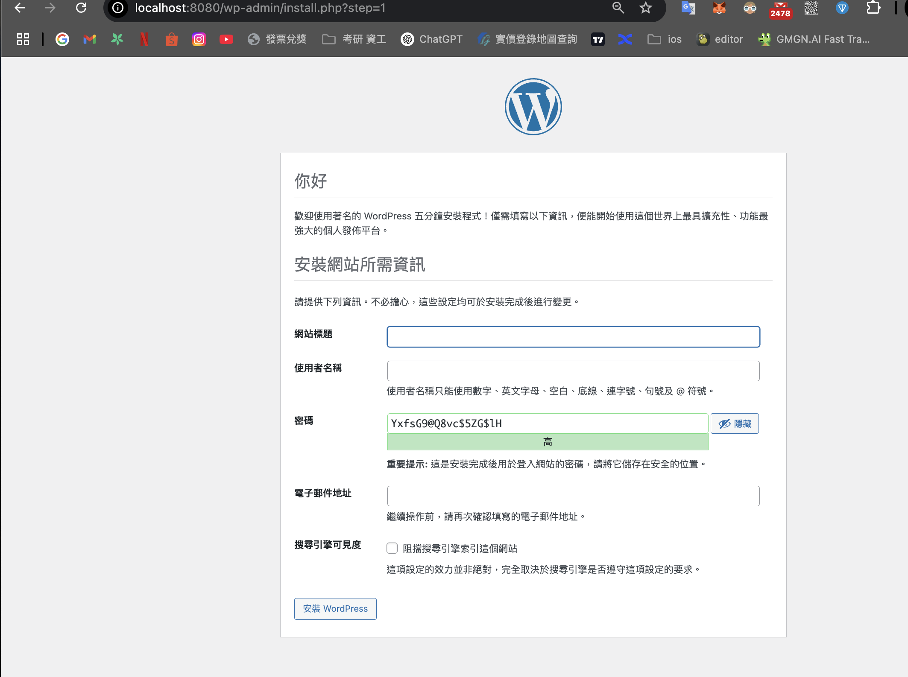
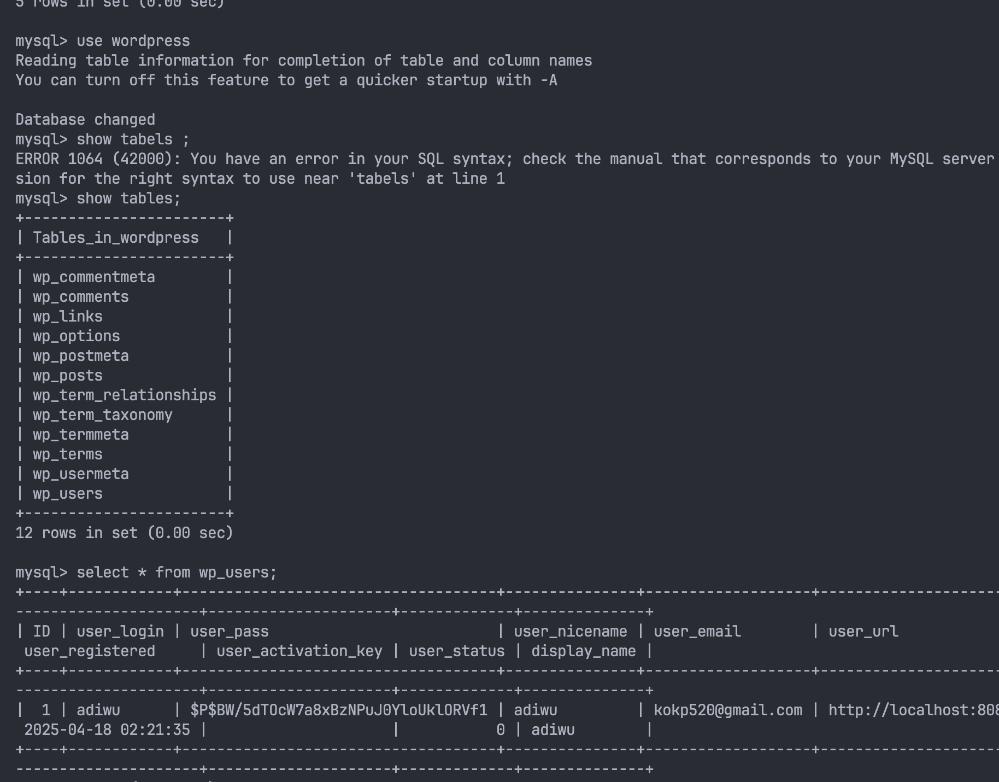
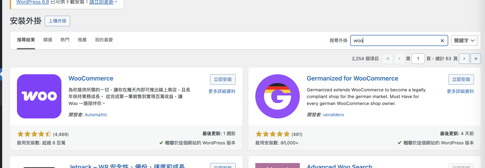
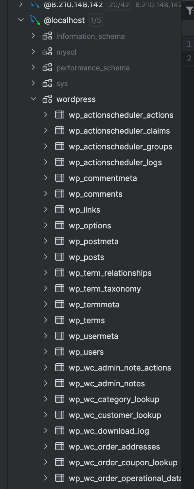

## log 

啟動nginx 
brew services start nginx

啟動php-fpm
brew services start php@8.4
/ brew services php-fpm


md wordpress
wget https://wordpress.org/latest.tar.gz

解壓縮之後 
創建nginx.conf in servers/wordpress.conf

wordpress.conf
```php
server {
    listen 8080;
    server_name localhost;

    root /Users/adiwu/repo/order-sys-framework/wordpress/src;
    index index.php;

    location / {
        try_files $uri $uri/ /index.php?$args;
    }

    location ~ \.php$ {
        fastcgi_split_path_info ^(.+\.php)(/.+)$;
        fastcgi_pass 127.0.0.1:9000;
        fastcgi_index index.php;
        include fastcgi_params;
        fastcgi_param SCRIPT_FILENAME $document_root$fastcgi_script_name;
        fastcgi_param PATH_INFO $fastcgi_path_info;
    }
} 
```

#### wp-config.php

修改資料庫名稱以及username, 以及設定基本資料表的前綴，都使用wp_比照技術文件

```
define( 'DB_NAME', 'wordpress' );
define( 'DB_USER', 'root' );
define( 'DB_PASSWORD', '' );
```


https://localhost:8080/wp-admin



註冊後會有下列表：




#### Install woocommerce




#### 頁面調整

在基本的頁面功能上使用基本功能



表的內容基本上還是比較基本

#### API的部分


